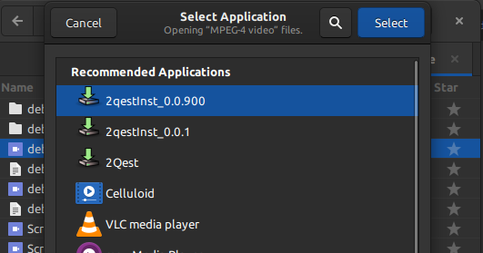
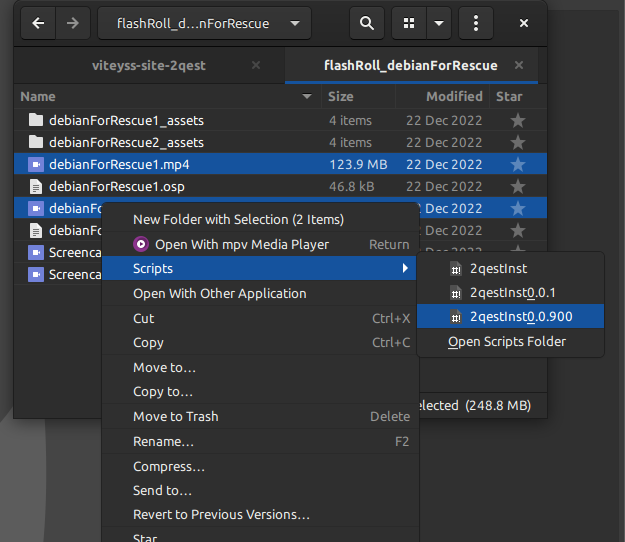
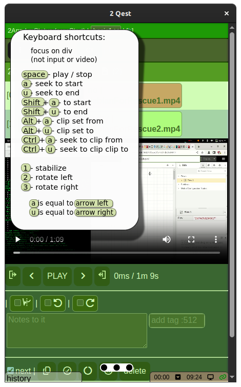

# viteyss-site-2qest

To make collecting assets to videos processing easy and as smooth it's possible.

With cameras in every pocket you horde Gigabytes of footage. It's pain full to sort it all. Imagine that you select in your file manager set of media files (videos). All that list in order of selection / sorting is shown in application. You can expand information by:

- is this asset is: ok | maby | no | delete

- clip | rotate | stabilize

- add notes 

- add tags

There is a video preview a.k.a. player with power full shortcuts operations: seeking, marking, clipping all from keys

### results

You can save your work and you can also generate some interesting stuff from this. 
Some examples:

##### as sh

This result can be use directly in bash / shell to execute command with copying needed assets / processing clips with `ffmpeg` / rotations .... / to point where all results are in `./_Ready/...` directory.

##### as shs

Same as `sh` but this time using build in `shs/tools` it give you power to send work over `ssh` `scp` work to yy server different device.

##### as twoCount

Work in progress ...

### dependency

This is a **viteyss-site-** pluging **site** so it need to be installed as a plugin in **viteyss**.

- viteyss-site-settings1
- nautilus (gnome file manager) - to have context menu option to send selection of files

### install

In this example of installation we will use those assumptions:

* your **viteyss** project, name [ tmp.KLBtHO7c6F ]
* full path to project [ /tmp/tmp.KLBtHO7c6F ]

```bash
cd /tmp/tmp.KLBtHO7c6F

git clone https://github.com/yOyOeK1/viteyss-site-2qest.git
cd ./viteyss-site-2qest
npm install
cd ../viteyss
npm install ../viteyss-site-2qest

cd ../
```

### starting my 2qest

So when you start **viteyss** project. It will appear in menu but it will be empty for now. 

For my semi security reasons I'm not hosting all your files by viteyss. That is easy version. Instead it host only what it needs. So start of `2Qest`  shooed be done by context menu from file manager. File manager have build filter / sorting options /... This allows u to narrow to media which will be use in this selection. 

For now it working on nautilus ( gnome file manage 3.36.3 let me know if it's working for you ) 

So selecting multiple files -> [ context menu / right button ]

[ Open With Other Application ] -> [ 2qestInst0.x.x ]



**OR**

[ Scripts ] -> [ 2qestInst0.x.x ]



This way **viteyss** is sawn up with arguments about additional files to host. In result in should show kiosk with 2Qest and your selection look [screenshot](#screenshot)'s

### screenshot



*Keyboard shortcuts cheat sheet.*

##### bugs

- [ ] don't check if different host is holding port

- [ ] don't give you option to select your kiosk chromium | firefox. option is in ./selector .sh but not in proces of instalation no dialog / menu

- [ ] o.O

---

If you see that this makes sense [ send me a ☕ ](https://ko-fi.com/B0B0DFYGS) | [Master repository](https://github.com/yOyOeK1/oiyshTerminal) | [About SvOiysh](https://www.youtube.com/@svoiysh)
